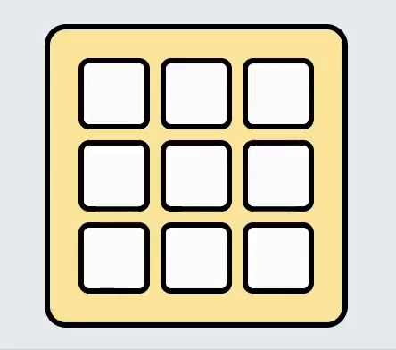

<div align="center">
 

 ##

 [](LICENSE)
 [](https://github.com/jackmayhew/soundle)

*A daily audio puzzle. Can you guess the sound?*

[🌐 Website](https://soundle.game/) | [💬 Support](https://github.com/jackmayhew/soundle/issues)


</div>

## About

Players listen to a short audio clip and submit guesses. Each guess is evaluated by an LLM, and returns a hint if incorrect.

Stats and streaks are stored so players can track their progress over time.

## Features

- New daily puzzle
- Play any past puzzle from the archive
- LLM-powered guess evaluation
- Player stats and streak tracking
- Share results and stats as text or an image
- Optional email reminders for new puzzles

## Tech stack

### Frontend (this repo)

- Nuxt 4
- Pinia
- TypeScript
- Zod
- Tailwind CSS
- GSAP

### Backend (separate repo)

- Fastify
- PostgreSQL
- TypeScript
- LLM integration

## Development

Install dependencies:

```bash
# Clone repository
git clone https://github.com/jackmayhew/soundle.git

# Install dependencies
pnpm install

# Run development server
pnpm dev  # Note: Full functionality requires a backend connection
```

The app runs at http://localhost:3000

## Contributing

Issues and pull requests are welcome.

## License

This project is licensed under CC BY-NC-SA 4.0. See [LICENSE](LICENSE) for details.
